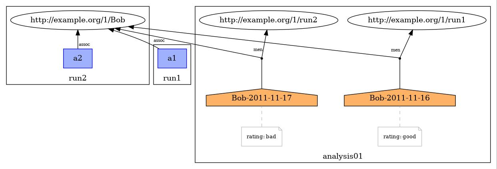

# ProvToolbox-mentionOf

Modified version of the [ProvToolbox](https://github.com/lucmoreau/ProvToolbox) java toolkit adding support to the Mention Of relation defined in the [Linking Across Provenance Bundles (PROV-LINKS)](https://www.w3.org/TR/prov-links/) group note, part of the PROV family of documents.

Based on the 2.0.4 version.  
Artifacts: prov-jsonld, prov-jsonld-xml, prov-model, prov-nf.  

### Mention Of
MentionOf is a ternary relation that denotes an entity e2 as a specialization of an entity e1 described in a bundle b.

[Example 1](https://www.w3.org/TR/prov-links/#anexample-mention-rating)
```
document
  prefix ex <http://example.org/1/>
  prefix tool <http://example.com/tool/>  
  prefix perf <http://example.com/performance/>
  bundle ex:run1
      activity(ex:a1, 2011-11-16T16:00:00, 2011-11-16T17:00:00)   //duration: 1hour
      wasAssociatedWith(ex:a1, ex:Bob, [prov:role='ex:controller'])
  endBundle
  bundle ex:run2
      activity(ex:a2, 2011-11-17T10:00:00, 2011-11-17T17:00:00)   //duration: 7hours
      wasAssociatedWith(ex:a2, ex:Bob, [prov:role='ex:controller'])
  endBundle
    bundle tool:analysis01
        agent(tool:Bob-2011-11-16, [perf:rating="good"])
        mentionOf(tool:Bob-2011-11-16, ex:Bob, ex:run1)
        agent(tool:Bob-2011-11-17, [perf:rating="bad"])
        mentionOf(tool:Bob-2011-11-17, ex:Bob, ex:run2)
    endBundle
endDocument
```



### Credits  
ProvToolbox project page http://lucmoreau.github.io/ProvToolbox/
